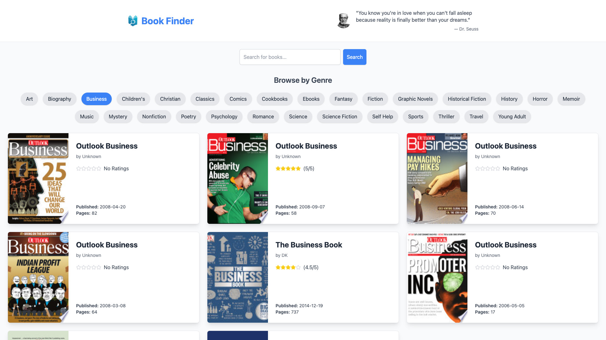
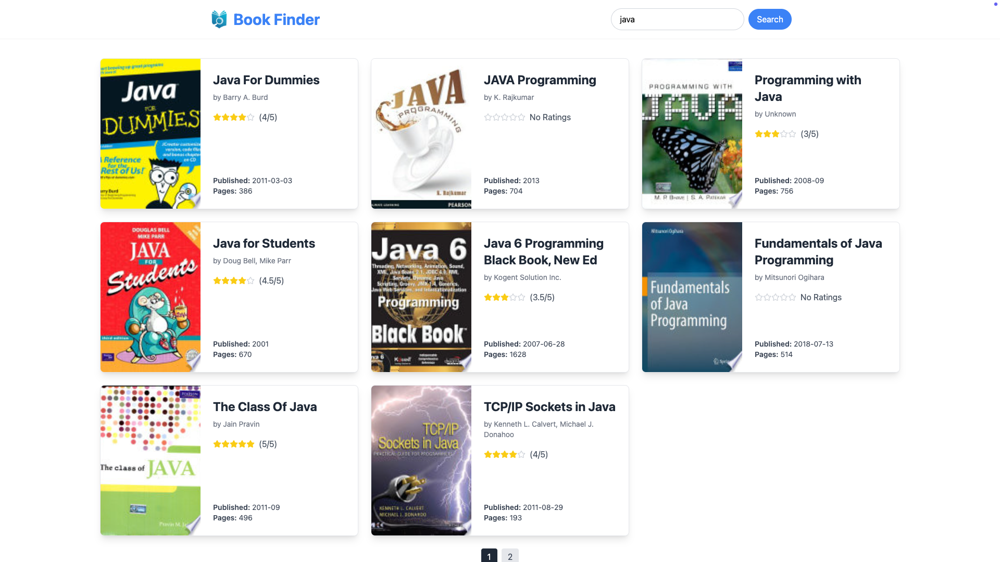
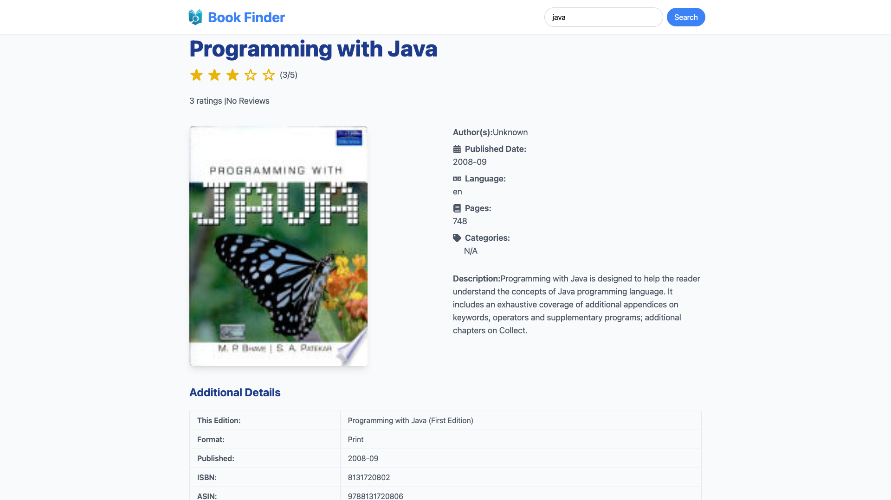

# BookFinder App 📚

BookFinder is a React-based web application that allows users to search, explore, and discover books using the powerful [Google Books API](https://developers.google.com/books). With an intuitive user interface and features like genre-based browsing and detailed book information, this app makes it easy to find your next great read.

## Features ✨
- **Search for books:** Enter a query to search for books by title, author, or keywords.
- **Browse by genres:** Quickly find books in your favorite genre.
- **View book details:** Get comprehensive details about the books, including descriptions, authors, and more.
- **Random book quotes:** Get inspired with a new book-related quote displayed dynamically.

---
## Technologies Used 🛠️
- React: Frontend library
- Google Books API: Book data source
- Tailwind CSS: Styling framework
- Axios: API requests

## Screenshots 📷

### 1. **Home Page**
The Home Page provides an intuitive search bar and a selection of genres for quick browsing.


---

### 2. **Book List Page**
Once a search is performed, the app displays a list of books matching the query. The books are neatly organized with pagination for easy navigation.


---

### 3. **Details Page**
Clicking on a book from the list leads to the Details Page, showcasing more information about the selected book.


---
## Env

To access the Google Books API, you need to set up an `.env` file in the root directory of your project with the following key:

```plaintext
REACT_APP_GOOGLE_BOOKS_API_KEY=your_google_books_api_key
